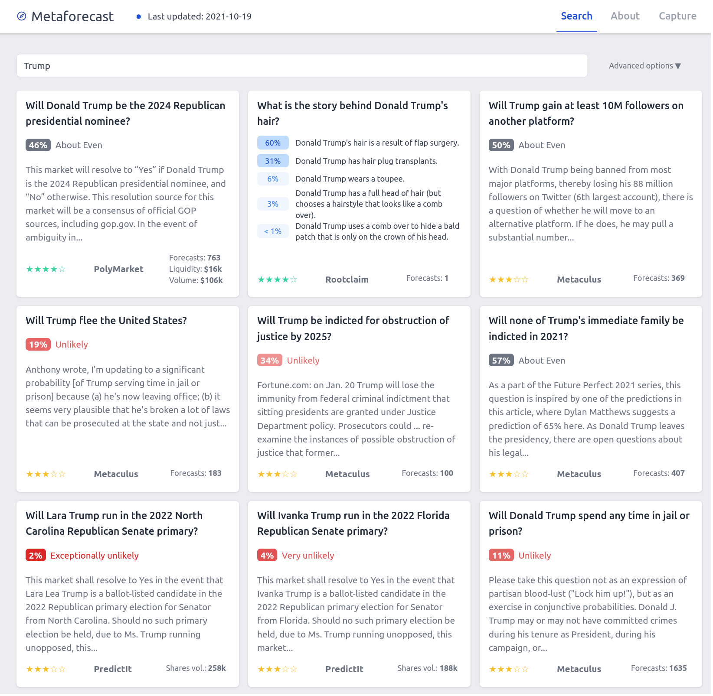

## What this is

[Metaforecast](https://metaforecast.org) is a search engine for probabilities from various prediction markes and forecasting platforms. Try searching "Trump", "China" or "Semiconductors".

This repository includes the source code for both the website and the library that fetches forecasts needed to replace them. We also aim to provide tooling to integrate metaforecast with other services.

[](https://metaforecast.org)

## How to run

### 1. Download this repository

```
$ git clone https://github.com/QURIresearch/metaforecast
$ cd metaforecasts
$ npm install
```

### 2. Set up a database and environment variables

You'll need a PostgreSQL instance, either local (see https://www.postgresql.org/download/) or in the cloud (for example, you can spin one up on https://www.digitalocean.com/products/managed-databases-postgresql or https://supabase.com/).

Environment can be set up with an `.env` file. You'll need to configure at least `DIGITALOCEAN_POSTGRES` for the fetching to work, and `NEXT_PUBLIC_SITE_URL` for the frontend.

See [./docs/configuration.md](./docs/configuration.md) for details.

### 3. Actually run

`npm run cli` starts a local CLI which presents the user with choices; if you would like to skip each step, use the option number instead, e.g., `npm run cli 14`.

`npm run next-dev` starts a Next.js dev server with the website on `http://localhost:3000`.

### 4. Example: download the metaforecasts database

```
$ git clone https://github.com/QURIresearch/metaforecast
$ cd metaforecasts
$ npm install
$ node src/backend/manual/manualDownload.js
```

## Integrations

Metaforecast has been integrated into:

- Twitter, using our [@metaforecast](https://twitter.com/metaforecast) bot
- [Global Guessing](https://globalguessing.com/russia-ukraine-forecasts/), which integrates our dashboards
- [Fletcher](https://fletcher.fun/), a popular Discord bot. You can invoke metaforecast with `!metaforecast search-term`
- [Elicit](https://elicit.org/), which uses GPT-3 to deliver vastly superior semantic search (as opposed to fuzzy word matching). If you have access to the Elicit IDE, you can use the action "Search Metaforecast database. This is not being updated regularly.

We also provide a public database, which can be accessed with a script similar to [this one](./src/backend/manual/manualDownload.js). We are also open to integrating our Algolia search instance with other trusted services (in addition to Fletcher.)

## Code layout

- frontend code is in [src/pages/](./src/pages/), [src/web/](./src/web/) and in a few other places which are required by Next.js (e.g. root-level configs in postcss.config.js and tailwind.config.js)
- various backend code is in [src/backend/](./src/backend/)
- fetching libraries for various platforms is in [src/backend/platforms/](./src/backend/platforms/)
- rudimentary documentation is in [docs/](./docs)

## What are "stars" and how are they computed

Star ratings—e.g. ★★★☆☆—are an indicator of the quality of an aggregate forecast for a question. These ratings currently try to reflect my own best judgment and the best judgment of forecasting experts I've asked, based on our collective experience forecasting on these platforms. Thus, stars have a strong subjective component which could be formalized and refined in the future. You can see the code used to decide how many stars to assign [here](./src/backend/utils/stars.js).

With regards the quality, I am most uncertain about Smarkets, Hypermind, Ladbrokes and WilliamHill, as I haven't used them as much. Also note that, whatever other redeeming features they might have, prediction markets rarely go above 95% or below 5%.

## Tech stack

Overall, the services which we use are:

- Algolia for search
- Netlify for website deployment
- Herokiu for background jobs, e.g. fetching new forecasts
- Postgres on DigitalOcean and Mongo for databases

## Various notes

- Commits follow [conventional commits](https://www.conventionalcommits.org/en/v1.0.0/#summary)
- For elicit and metaculus, this library currently filters out questions with <10 predictions.
